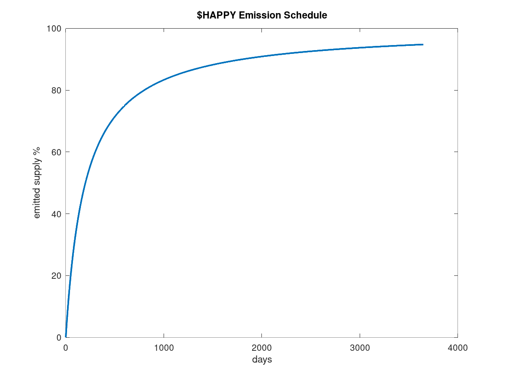

# Happy

HAPPY 🐸 is [an ERC20 token](https://eips.ethereum.org/EIPS/eip-20) with a novel staking algorithm.

## Macrotokenomics

### Reward Allocations

90% of emissions will go to HAPPY-WAVAX PGL (Pangolin Liquidity Token) stakers, and
10% of emissions will go to CryptoFrens NFT stakers. There will be no developer allocation,
VC allocation, advisor allocation, nor treasury allocation. All the emissions will be
distributed to the community through asset staking. After the sale of all CryptoFrens
NFTs, the NFTs will be backed slightly below their minting price. Then we plan to
reduce the NFT staking allocation, and increase LP staking allocation. Technically,
the reward allocations can be changed by the owner. However, off-chain voting methods
will be utilized to democratize the process.

### Emission Schedule

For `n` seconds `n / (200 days + n)` of the remaining supply is emitted. The remaining
supply means `maxSupply + burnedSupply - emittedSupply`. The emitted supply is the supply
that has been marked as mintable up to that point by the minter contract. Not all
`emittedSupply` has to be minted at that point. `maxSupply` will be set to 10 million.

The above curve is the idealized emission schedule. In practice, circulating supply
will be lagging behind the idealized emission schedule, and the sporadic burning of
HAPPY will undulate the circulating supply curve.

### Token Burns

The burning of the tokens will be incentivized with future products. Another mechanism
for burning HAPPY is a transaction tax which burns all the tax. Transaction tax is
initially set to 0% in the HAPPY token contract.

### Governance

On-chain governance will be able to change the transaction tax, the maximum supply
of HAPPY, and the minter contract. The latter two allows tokenomics of HAPPY to be
completely altered. This will prevent the need to roll up new versions of HAPPY for
every tokenomic change or for a discovery of an exploit. However, a major change to
tokenomics is unlikely for the short term. We will not push for a tokenomic change
unless an uprecedented growth of HAPPY takes place. And we also pay great attention to
create an exploit-free protocol.

## Microtokenomics

Most of the current staking algorithms are derived from [Synthetix’ implementation](https://github.com/Synthetixio/synthetix/blob/v2.54.0/contracts/StakingRewards.sol).
This implementation simply distributes the rewards proportional to the stake amount of
an account. To encourage sticky liquidity, many protocols have implemented *ad hoc*
“solutions” such as “paper-hand fees”, which seizes portion of user’s tokens if it is
withdrawn earlier than an arbitrary duration. We have seen that such solutions do not
work, and often only benefit to the developers’ pockets. In contrast, HAPPY is built
from ground up to provide a novel model to elegantly encourage long-term staking and
discourage withdrawing or selling harvests.

### Reward Rate Based on Staking Duration

HAPPY staking model considers both the stake amount and the *staking duration* when
calculating the user’s share of rewards. At each withdraw, deposit, or harvest events,
the staking duration of the user resets to zero. The deviation of the user’s staking
duration from the average staking duration is factored into the calculation of the
reward rate of the user. However, simple staking duration averaging calculations on
top of Synthetix’ model cannot account for the changes in both the reward rate and
the average staking duration while the user has been staking. Therefore, a novel
staking model had to be invented. The HAPPY algorithm can handle arbitrary changes
in the global reward rate, and it ensures that the sum of users’ rewards for a given
duration will always equal to the total allocated rewards for that duration.

### Multiple Deposits with Position-Based Account Tracking

We had mentioned that the staking duration resets on withdraw, deposit, or harvest.
However, depositing is a positive event for the farm’s health. Therefore, it should
not be discouraged by resetting the staking duration of an existing user. To prevent
this, staking duration, balance, and rewards are tracked as positions instead of
users. This way, a user can have infinite positions which hold different balances at
different staking durations. The default deposit event opens a new position for the
user instead of resetting an existing position. This prevents the need to use multiple
wallet addresses to increase one’s stake without resetting the staking duration.

### Locked-Deposit Harvesting

Harvesting can be a desirable or an undesirable event for the farm’s health. If the
user sells the rewards, that would be undesirable. If the user adds more liquidity
with the rewards, that would be desirable. However, there is no way to know beforehand
how the user will spend those rewards. Therefore, the staking duration for the
position is reset to zero whenever the rewards are harvested. An alternative way
to harvest the rewards in a way that is beneficial to the farm is *locked-deposit harvesting*.
In this method, rewards never leave the contract. Instead, the user has
to transfer equivalent pair tokens to the staking contract. The staking contract then
pairs the two tokens and creates a new position with the pool tokens. The new position
is considered the child of the position from which the rewards were harvested. When
a position has a parent, its stake cannot be withdrawn until the parent position’s
staking duration is reset at least once after the creation of the child position. This
feature is only available in LP staking, where the reward token is one of the tokens
in the LP pair.

With these features, we believe that HAPPY has what it takes to become the greatest
ponzi scheme ever by replacing the Federal Reserve 🤡
